<h1 align="center">
    
    
<strong>Aura</strong>

    
    
    
    
</h1>

<b>High-performance video player powered by Vulkan Video hardware acceleration.<b>

> [!WARNING]
> Experimental software: bugs, crashes, and undefined behavior are expected.

## Stonks!!

